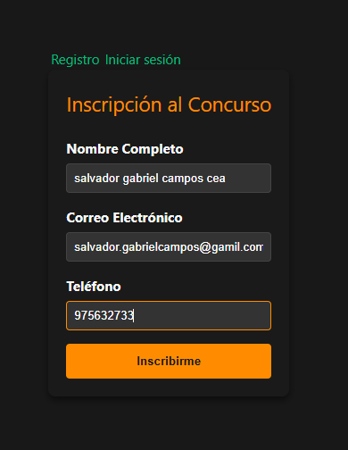
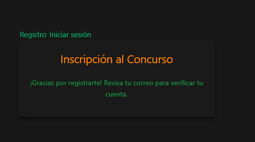
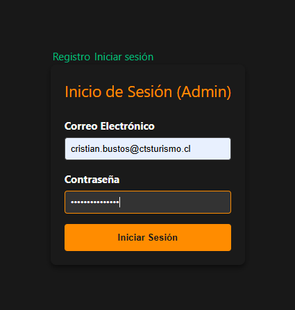
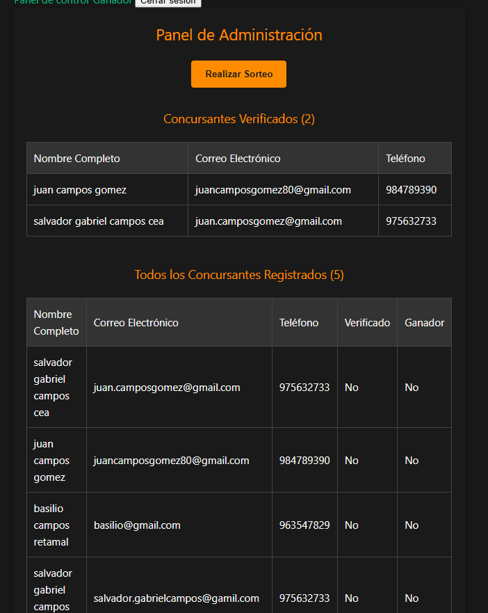
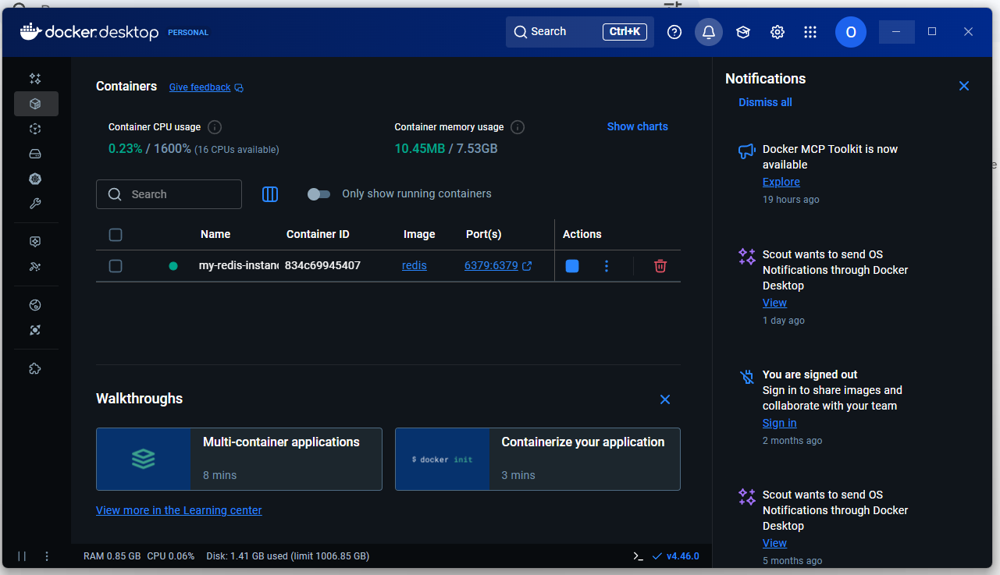
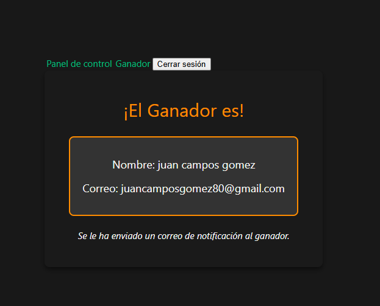

# valentinecontest

Ruta	                                 Descripción
POST /api/contestants/	                 Registro inicial (nombre, email, teléfono)
POST /api/verify-account/	         Verificación con token + creación de contraseña
POST /api/token/	                 Login de administrador
GET /api/contest/verified-contestants/	 Lista de concursantes verificados
POST /api/contest/draw-winner/	         Sorteo aleatorio
POST /api/send-winner-email/	         Envío de correo al ganador (usado por Celery)


---------------------------------------------------------------------------------------

Requisito	              Estado	   Detalles
Inscripción con validación	✅	Ya lo tienes con validación de email
Verificación por correo 	X	Se genera token y se envía el enlace
Creación de contraseña	        ✅	VerifyView.vue lo permite
Confirmación de participación	✅	Mensaje claro tras verificación
Sorteo de ganador	        ✅	Botón en DashboardView.vue
Notificación al ganador	        ✅	Lo armamos con Celery ahora
Vistas principales	        ✅	Todas están presentes
Seguridad	                ✅	JWT, rutas protegidas, contraseñas encriptadas
Escalabilidad			✅	Redis + Celery para correos
Buenas prácticas		✅	Código modular, validaciones, manejo de errores
Tests				✅	Si tienes tiempo, te ayudo a crear uno básico

-----------------------------------------------------------------------------------------
# 🎯 Valentine Contest App

Aplicación web full-stack para gestionar un concurso con registro de participantes, verificación por correo electrónico y sorteo de ganador. Desarrollada con Vue.js y Django REST Framework, e integrada con Celery para tareas asíncronas como envío de correos.

---

## 📦 Estructura del Repositorio

valentine-contest/
├── backend/ # Django + DRF + Celery + Redis 
│ ├── valentine_contest/ 
│ ├── config/ 
│ ├── manage.py 
│ └── requirements.txt 
├── frontend/ # Vue.js + Pinia + Axios 
│ ├── src/ 
│ ├── public/ 
│ └── package.json 
└── README.md # Este archivo


-------------------------------------------------------------------------------------
## ⚙️ Instalación y Ejecución

### 🔧 Backend (Django + Celery)

```bash
cd backend
python -m venv env
source env/bin/activate  # o env\Scripts\activate en Windows
pip install -r requirements.txt
python manage.py migrate
python manage.py runserver

-----------------------------------------------------------------------------------------
🚀 Celery + Redis
# Asegúrate de tener Redis corriendo
redis-server

# En otra terminal, ejecuta el worker de Celery
celery -A config worker --loglevel=info

------------------------------------------------------------------------------------------
💻 Frontend (Vue.js)
cd frontend
npm install
npm run dev
-------------------------------------------------------------------------------------------
🧠 Decisiones Técnicas
Vue.js + Pinia para una arquitectura frontend moderna y reactiva.

Django REST Framework por su robustez y facilidad para construir APIs seguras.

JWT Authentication para proteger rutas y operaciones administrativas.

Celery + Redis para manejar tareas asíncronas como envío de correos sin bloquear el flujo principal.

Email Backend de consola para desarrollo local sin necesidad de SMTP real.

Separación clara de roles: usuarios pueden registrarse y verificar, mientras que el admin gestiona el sorteo.

-------------------------------------------------------------------------------------------
📡 Endpoints Principales

🔐 Autenticación
POST /api/token/

* Request:
{ "username": "admin@example.com", "password": "adminpass" }

*Response:
{ "access": "jwt_token", "refresh": "refresh_token" }

📝 Registro de Concursantes
POST /api/contestants/

*Request:
{ "full_name": "Juan Campos", "email": "juan@example.com", "phone": "987654321" }

*Response:
{ "message": "Inscripción exitosa. Revisa tu correo para verificar tu cuenta." }

✅ Verificación de Cuenta
POST /api/verify-account/

*Request:
{ "token": "abc123", "password": "securepass" }

*Response:
{ "message": "Tu cuenta ha sido verificada. ¡Ya estás participando en el sorteo!" }


📋 Listado de Verificados (Admin)
*GET /api/verified-contestants/ (requiere token admin)

🎁 Sorteo de Ganador (Admin)
*POST /api/contest/draw-winner/ (requiere token admin)

*Response:
{ "full_name": "Juan Campos", "email": "juan@example.com" }

--------------------------------------------------------------------------------------
📸 Screenshots
Registro de Concursantes

Verificación Exitosa

Panel de Administración

----------------------------------------------------------------------------------------
✅ Test Unitario
*Bash
python manage.py test valentine_contest.tests.test_draw
-------------------------------------------------------------------------------------
## 📸 Flujo de la aplicación

### 📝 Formulario de inscripción


### ✅ Registro exitoso


### 🔐 Login de usuario


### 🧑‍💼 Panel de administración


### 📊 Dashboard Django


### 🐳 Dashboard Docker


### 🎉 Ganador del concurso



--------------------------------------------------------------------------------------
👨‍💻 Autor
Juan Campos Gómez Desarrollador Full-Stack | Vue.js + Django REST | Celery + Redis Contacto: juan.camposgomez@gmail.com

